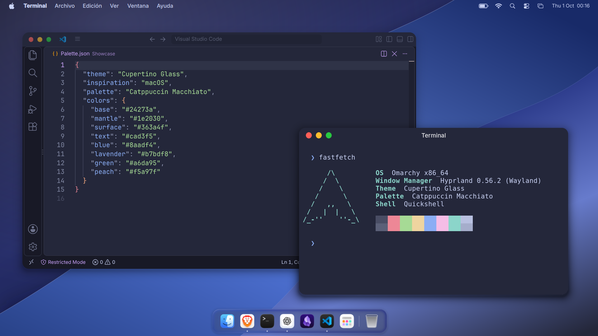

# Cupertino Glass

A macOS-inspired theme for **Omarchy 4**, with a Catppuccin Macchiato palette, blue folded-wave wallpaper, and an optional desktop profile with a magnifying dock, application grid, control center and compact menu bar.



## Install the theme

```sh
omarchy theme install https://github.com/Saimper/omarchy-cupertino-glass-theme
```

This installs the palette and wallpaper through Omarchy's normal theme mechanism. Switch back to another theme with the usual theme selector. It does not install the optional desktop profile.

## Install the complete desktop profile

The dock, control center and menu bar in the screenshot come from the separate profile in `profile/`. It requires Omarchy 4's Quickshell shell, Lua-based Hyprland configuration, Python 3, GTK 3/4, fontconfig and JetBrainsMono Nerd Font. It was developed on Hyprland 0.56.2; inspect the configuration before using a different compositor version.

```sh
git clone https://github.com/Saimper/omarchy-cupertino-glass-theme
cd omarchy-cupertino-glass-theme
./profile/bin/cupertino install
~/.local/bin/cupertino apply dark
```

The installer refuses to overwrite an existing Cupertino installation. It stores assets in `~/.local/share/cupertino-glass` and recovery snapshots in `~/.local/state/cupertino-glass`. Keep those snapshots. The full profile changes user configuration and appearance preferences; it does not replace Omarchy's packaged system files.

Switch with the **Profiles** menu or these commands:

```sh
cupertino apply light
cupertino apply dark
cupertino restore
cupertino status
```

The profile manager saves separate configurations for the original desktop and each variant. Choosing another Omarchy theme restores the previous desktop configuration. `cupertino uninstall` restores the desktop and removes managed links while retaining assets and recovery data.

## Desktop behavior

- Floating windows, `Super+O` to maximize within the usable screen area, and `Super+A` for the application grid.
- A compact dock with pointer magnification, neighboring-icon expansion, running indicators and window selection.
- Brightness, volume and media controls, with network, Bluetooth and system panels provided by Omarchy.
- Inter Variable for the interface, MacTahoe GTK/icon themes, matching terminal colors and an original optional startup chime. Disable it with `cupertino sound off`.
- Theme switching that preserves existing files, symlinks, permissions and unrelated settings.

This is a Linux desktop, not macOS. File management uses Nautilus. Application menus and window decorations depend on the application toolkit; there is no promise of identical controls in every app.

## Optional native window controls

Source for Hyprbars and the window-action bridge is included, but compiled compositor plugins are not distributed. They only load when both binaries exist and Hyprland reports the exact supported revision, `efb50993780079460b0cbed1363e2166a2de1d9f` (0.56.2). Without them, the profile keeps standard controls. GTK applications can still use the GTK theme's buttons.

To build these optional components, matching Hyprland development headers and a C++23 toolchain are required. Run this **before** installing the full profile:

```sh
./profile/scripts/build-native-controls.sh
```

Application-specific adapters under `profile/adapters/` are optional, version-pinned source tools. Application binaries are not included and are not patched by installing the palette. Unsupported app/compositor versions need a separate compatibility review. Close and reopen an application normally when its toolkit requires it; do not terminate work in progress to refresh decorations.

## Screenshot and public assets

The screenshot is a real 1920×1080 session with only demonstration content, the bundled wallpaper, VS Code and Foot. It shows the full local profile, including optional window decorations and locally installed application icons. The distributable profile uses the open MacTahoe icon theme and Nerd Font status symbols; individual icons can therefore differ from the local preview. It does not include extracted Apple symbol catalogs, Apple wallpapers, SF Pro, proprietary application binaries or compiled Apple materials.

The original wallpaper source is in `artwork/`. Dependencies and their pinned revisions are listed in [`profile/sources.lock.json`](profile/sources.lock.json). See [third-party notices](THIRD_PARTY.md) for component licenses.

## Validation

```sh
cd profile
python3 -m unittest discover -s tests -v
```

The 31 unit tests exercise profile isolation, rollback, file/symlink preservation, application appearance adapters and window recovery using temporary directories. They do not establish compatibility with every application or future Omarchy release.

Original project code, wallpaper and synthesized sound are MIT licensed. Bundled third-party resources retain their own licenses. This project is not affiliated with Apple or Omarchy.
